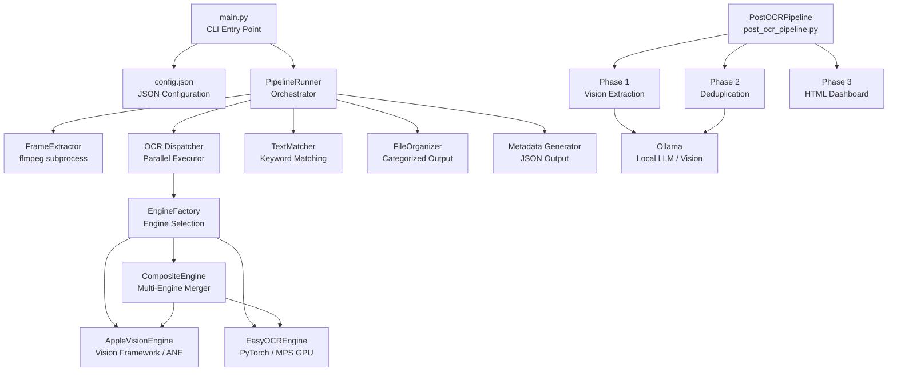
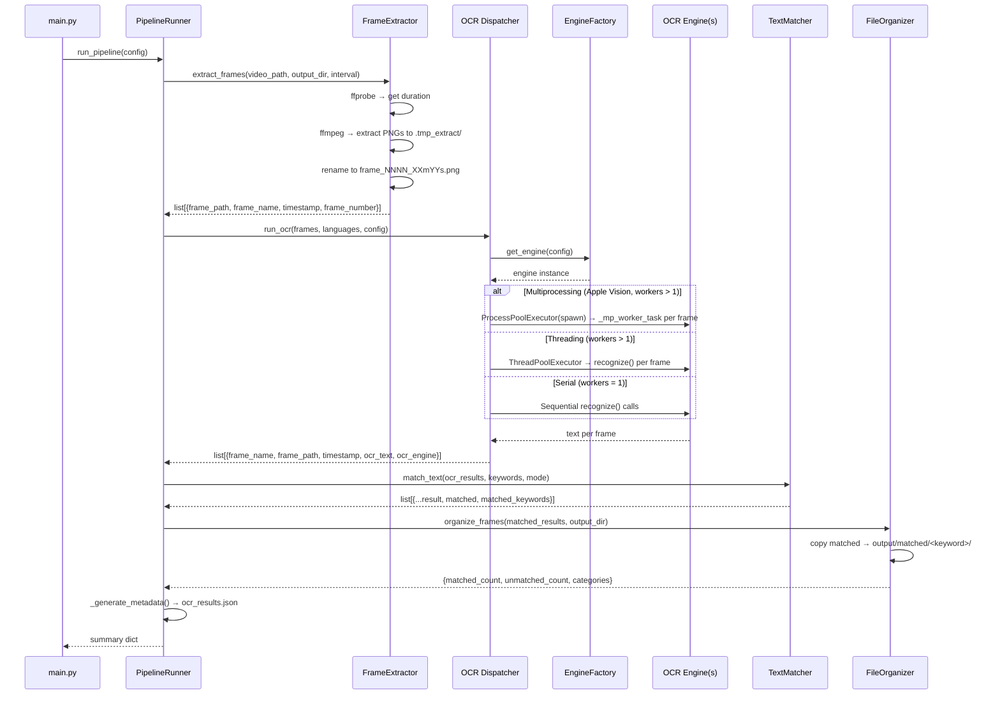
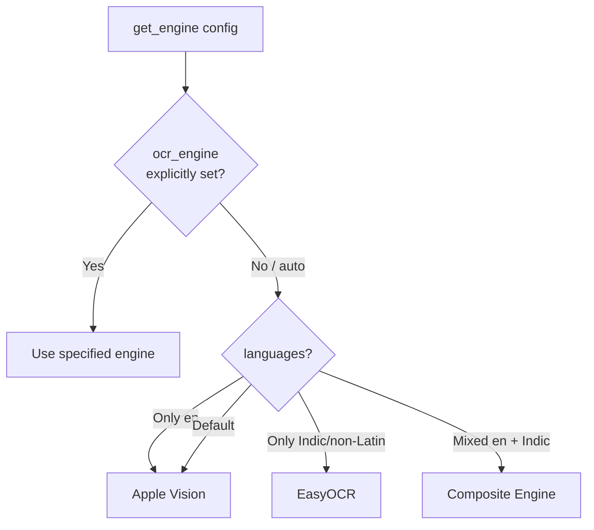
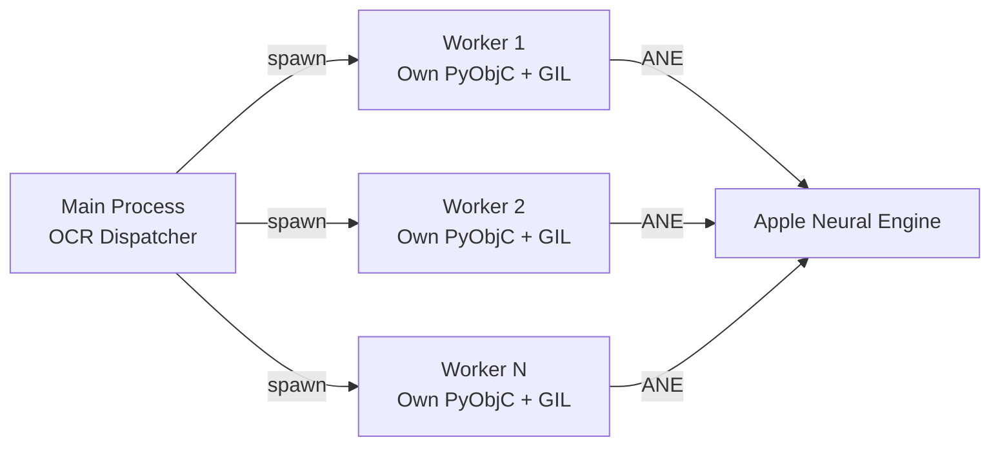
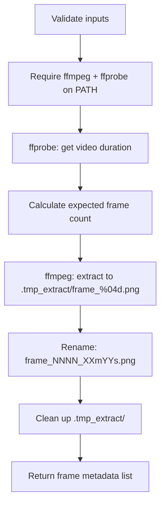
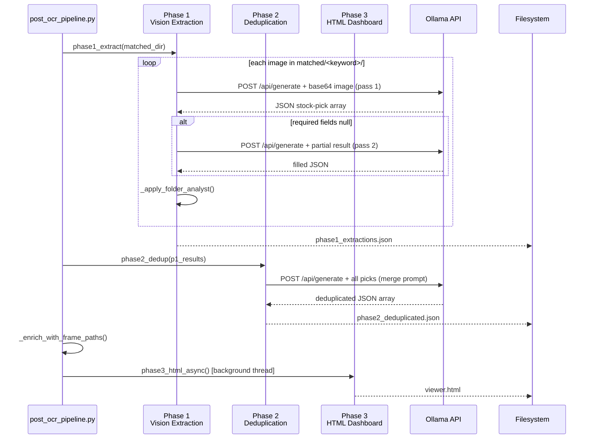

# LOCALOCR — Technical Architecture Document

## 1. System Overview

LOCALOCR is a local-first macOS pipeline that processes video files into searchable, categorized screenshot collections using OCR. The system operates entirely offline with zero cloud dependencies.

**Core Pipeline:**
```
MP4 Video → Frame Extraction (ffmpeg) → OCR (Apple Vision / EasyOCR) → Text Matching → File Organization → Metadata
```

**Design Principles:**
- Offline/local-first — no network calls, no data leaves the machine
- Modular — each pipeline stage is independently replaceable
- Pluggable OCR — new engines can be added without modifying the pipeline
- Hardware-aware parallelism — leverages Apple Neural Engine, MPS GPU, and multi-core CPU

---

## 2. Component Architecture

### 2.1 High-Level Component Diagram



### 2.2 Directory Layout

```
LOCALOCR/
├── main.py                          # CLI, arg parsing, logging setup
├── post_ocr_pipeline.py             # Standalone LLM post-OCR pipeline (Phase 1-3)
├── config/
│   └── config.json                  # Pipeline configuration
├── src/
│   ├── __init__.py
│   ├── analyzer/
│   │   ├── __init__.py
│   │   └── ollama_analyzer.py       # Low-level Ollama vision helper (ad-hoc use)
│   ├── extractor/
│   │   ├── __init__.py
│   │   └── frame_extractor.py       # ffmpeg-based video → PNG frames
│   ├── ocr/
│   │   ├── __init__.py
│   │   ├── base_engine.py           # OCREngine ABC
│   │   ├── engine_factory.py        # Engine auto-selection logic
│   │   ├── apple_vision_engine.py   # Apple Vision Framework implementation
│   │   ├── easyocr_engine.py        # EasyOCR implementation
│   │   ├── composite_engine.py      # Multi-engine orchestrator
│   │   └── ocr_engine.py            # run_ocr() dispatcher + parallelism
│   ├── matcher/
│   │   ├── __init__.py
│   │   └── text_matcher.py          # Keyword/regex matching
│   ├── organizer/
│   │   ├── __init__.py
│   │   └── file_organizer.py        # File copy + categorization (Unicode-safe)
│   └── pipeline/
│       ├── __init__.py
│       └── pipeline_runner.py       # Full pipeline orchestration
├── input_videos/                    # Source video files
├── output/
│   ├── all_frames/                  # Every extracted frame
│   ├── matched/<keyword>/           # Frames matching each keyword
│   ├── viewer.html                  # Self-contained stock picks HTML dashboard
│   └── metadata/
│       ├── ocr_results.json         # Full OCR + match metadata
│       ├── phase1_extractions.json  # Per-frame LLM extraction results
│       └── phase2_deduplicated.json # Final deduplicated stock picks
└── logs/
    └── localocr.log                 # Debug-level execution log
```

---

## 3. Pipeline Execution Flow

### 3.1 Full Pipeline (`run_pipeline`)



### 3.2 OCR-Only Pipeline (`run_ocr_only_pipeline`)

Skips frame extraction. Reads existing PNG files from `all_frames/` directory, reconstructs frame metadata from filenames using regex `frame_(\d{4})_(\d{2})m(\d{2})s\.\w+`, then runs Steps 2–4.

---

## 4. OCR Engine System — Detailed Design

### 4.1 Engine Abstraction (`OCREngine` ABC)

```python
class OCREngine(ABC):
    @abstractmethod
    def recognize(self, image_path: str, languages: list = None) -> str: ...
    @abstractmethod
    def supported_languages(self) -> list: ...
    @property
    @abstractmethod
    def name(self) -> str: ...
    @property
    def max_parallel_frames(self) -> int: return 1
    @property
    def supports_multiprocessing(self) -> bool: return False
    def worker_init_args(self) -> dict: return {}
```

All engines implement this interface. The `supports_multiprocessing` flag controls whether the dispatcher uses `ProcessPoolExecutor` (spawn) or `ThreadPoolExecutor`.

### 4.2 Engine Selection Logic (`engine_factory.py`)



**Indic/EasyOCR languages:** `hi, mr, ne, ta, te, bn, gu, kn, ml, pa, ar, ja, ko`

### 4.3 Apple Vision Engine

| Aspect | Detail |
|--------|--------|
| Framework | macOS Vision Framework via PyObjC (`VNRecognizeTextRequest`) |
| Hardware | Apple Neural Engine (ANE) + CPU |
| Recognition levels | `accurate` (default, higher quality) or `fast` (3-6× faster) |
| Language correction | Optional linguistic post-processing (+50-80ms/frame) |
| Parallelism | Multi-process via `spawn` context; each process gets own PyObjC runtime |
| Language mapping | `en` → `en-US`, `hi` → `hi-Deva`, etc. |
| Throughput | ~3× at 4 workers vs single-threaded (benchmarked) |

**Process flow:**
1. Load image via `CGImageSourceCreateWithURL`
2. Create `VNRecognizeTextRequest` with recognition level + language settings
3. Execute via `VNImageRequestHandler.performRequests_error_`
4. Extract `topCandidates_(1)` from each `VNRecognizedTextObservation`
5. Join text lines with newlines

### 4.4 EasyOCR Engine

| Aspect | Detail |
|--------|--------|
| Framework | EasyOCR (PyTorch-backed) |
| Hardware | MPS GPU (Apple Silicon) or CPU |
| Thread safety | Global `_readtext_lock` serializes all `readtext()` calls |
| Model caching | Reader instances cached per language combo in `_readers` dict |
| Confidence filtering | Lines below `confidence_threshold` (default 0.3) are discarded |
| Model download | ~100MB on first use, cached in `~/.EasyOCR/` |

### 4.5 Composite Engine — Merge Strategy

When both English and Indic languages are needed, `CompositeEngine` runs both engines concurrently and merges results:

1. **Parallel execution**: Apple Vision and EasyOCR run simultaneously via `ThreadPoolExecutor` (they use different hardware — CPU/ANE vs MPS GPU)
2. **Primary engine** (Apple Vision, index 0): All lines are kept verbatim
3. **Secondary engines** (EasyOCR, index 1+): Only lines containing **non-Latin script** characters (Devanagari, Bengali, Tamil, Arabic, CJK, etc.) are kept
4. **Deduplication**: Exact-string duplicates across all engines are removed

This prevents EasyOCR from re-adding numbers and English words that Apple Vision already captured with higher accuracy.

**Non-Latin detection:** Any character in Unicode ranges: Devanagari (U+0900–097F), Bengali, Gurmukhi, Gujarati, Odia, Tamil, Telugu, Kannada, Malayalam, Arabic, CJK, Hiragana/Katakana, Hangul.

---

## 5. Parallelism & Concurrency Model

### 5.1 Execution Modes

| Mode | Trigger | Executor | Use Case |
|------|---------|----------|----------|
| **Multiprocessing** | `engine.supports_multiprocessing == True` AND `workers > 1` | `ProcessPoolExecutor(spawn)` | Apple Vision — bypasses GIL + PyObjC serialization |
| **Threading** | `supports_multiprocessing == False` AND `workers > 1` | `ThreadPoolExecutor` | Engines with I/O-bound work |
| **Serial** | `workers == 1` | Sequential loop | Debugging, low-resource systems |

### 5.2 Multiprocessing Architecture (Apple Vision)



**Worker lifecycle:**
1. `_mp_worker_init`: Import engine class dynamically, construct fresh instance, warm up with first frame
2. `_mp_worker_task`: Process one frame — returns `(idx, frame_name, timestamp, frame_number, text, error)`
3. Results ordered by original frame index for deterministic output

**Why `spawn` not `fork`:** PyObjC Objective-C runtime is not fork-safe. Each worker process must initialize its own Vision Framework handle.

### 5.3 Progress Reporting

All execution paths report progress every 20 frames:
```
OCR progress: 20/150 frames processed
OCR progress: 40/150 frames processed
...
```

---

## 6. Frame Extraction Subsystem

### 6.1 Workflow



### 6.2 ffmpeg Command

```bash
ffmpeg -hide_banner -loglevel error \
  -i <video_path> \
  -vf "fps=1/<interval>" \
  -vsync vfr \
  <tmp_dir>/frame_%04d.png
```

- `-vf fps=1/N`: Extract 1 frame every N seconds
- `-vsync vfr`: Variable frame rate (avoids duplicate frames)
- Timeout: `max(300, duration * 3)` seconds

### 6.3 Supported Formats

`.mp4`, `.webm`, `.mkv`, `.mov`, `.avi`, `.m4v`

### 6.4 Frame Naming Convention

```
frame_0001_00m00s.png   → Frame 1, timestamp 0:00
frame_0002_00m03s.png   → Frame 2, timestamp 0:03 (3s interval)
frame_0045_02m12s.png   → Frame 45, timestamp 2:12
```

---

## 7. Text Matching System

### 7.1 Match Modes

| Mode | Behavior | Example |
|------|----------|---------|
| `contains` | Case-insensitive substring search | `"FII"` matches `"Net FII Activity: +2500 Cr"` |
| `exact` | Case-insensitive full-line match | `"FII"` matches only a line that is exactly `"fii"` |
| `regex` | Python `re.search` with `IGNORECASE` | `"FII\|DII"` matches either pattern |

### 7.2 Output Enrichment

Each OCR result dict is enriched with:
```json
{
  "matched": true,
  "matched_keywords": ["FII", "Sethi"]
}
```

---

## 8. File Organization

### 8.1 Output Structure

```
output/
├── all_frames/              # Copies of all frames (regardless of match)
├── matched/
│   ├── fii/                 # Frames matching "FII"
│   │   ├── frame_0012_00m33s.png
│   │   └── frame_0045_02m12s.png
│   └── sethi/               # Frames matching "Sethi"
│       └── frame_0023_01m06s.png
└── metadata/
    └── ocr_results.json     # Full OCR text + match results
```

### 8.2 Folder Name Sanitization

Keywords are converted to safe folder names:
- NFC Unicode normalization applied first
- Lowercased
- Non-alphanumeric characters → `_`, **except** Unicode combining marks (category `M`) which are preserved — this keeps Devanagari/Indic matras (ि, ी, ू …) intact in folder names like `सेठी/`
- Consecutive underscores collapsed to one
- Leading/trailing underscores stripped
- Empty result → `"uncategorized"`

---

## 9. Metadata Format

`output/metadata/ocr_results.json`:

```json
[
  {
    "frame": "frame_0001_00m00s.png",
    "timestamp": "00m00s",
    "matched": false,
    "matched_keywords": [],
    "ocr_text": "LIVE 9:15 AM Market Opening..."
  },
  {
    "frame": "frame_0012_00m33s.png",
    "timestamp": "00m33s",
    "matched": true,
    "matched_keywords": ["FII"],
    "ocr_text": "FII Net Activity: +2500 Cr | DII: -1200 Cr"
  }
]
```

---

## 10. Configuration Deep Dive

### 10.1 OCR Config Options

```json
{
  "ocr_config": {
    "easyocr_gpu": true,
    "easyocr_confidence_threshold": 0.3,
    "apple_vision_workers": 8,
    "recognition_level": "accurate",
    "use_language_correction": false,
    "ocr_workers": 1
  }
}
```

| Key | Type | Default | Description |
|-----|------|---------|-------------|
| `easyocr_gpu` | bool | `false` | Enable MPS/CUDA GPU acceleration for EasyOCR |
| `easyocr_confidence_threshold` | float | `0.3` | Min confidence [0-1] to accept a text line |
| `apple_vision_workers` | int | `2` | Process pool size for Apple Vision engine |
| `recognition_level` | string | `"accurate"` | `"accurate"` or `"fast"` (3-6× faster) |
| `use_language_correction` | bool | `true` | Linguistic post-processing (+50-80ms/frame) |

### 10.2 Performance Tuning

| Scenario | Recommended Config |
|----------|-------------------|
| Fast scan, large video | `recognition_level: "fast"`, `use_language_correction: false`, `interval: 5` |
| High accuracy, short video | `recognition_level: "accurate"`, `use_language_correction: true`, `interval: 1` |
| Hindi + English | `languages: ["hi", "en"]`, engine auto-selects composite |
| Maximum throughput | `apple_vision_workers: 8`, `easyocr_gpu: true` |

---

## 11. Error Handling Strategy

### 11.1 Exception Hierarchy

```
PipelineError (fatal, stops pipeline)
├── FrameExtractionError (ffmpeg failures, missing binary, bad video)
└── OCRError (engine initialization failure, image decode error)
```

### 11.2 Error Recovery

| Component | Failure Mode | Behavior |
|-----------|-------------|----------|
| Frame Extraction | ffmpeg not found | Fatal — raises `FrameExtractionError` |
| Frame Extraction | ffprobe timeout | Fatal — 30s timeout |
| Frame Extraction | Zero frames produced | Fatal |
| OCR | Single frame fails | Warning logged, empty text, pipeline continues |
| OCR | Engine init fails | Fatal — raises `OCRError` |
| Text Matching | Invalid regex | Warning logged, returns `False` for that pattern |
| File Organization | Source frame missing | Warning logged, skipped |
| Pipeline | `KeyboardInterrupt` | Graceful exit (code 130) |

### 11.3 Logging Levels

| Level | Content |
|-------|---------|
| DEBUG | ffmpeg commands, per-frame OCR results, individual match results |
| INFO | Pipeline progress, step completion, summary statistics |
| WARNING | Non-fatal failures (single frame OCR error, missing files) |
| ERROR | Fatal pipeline failures |

---

## 12. External Dependencies

### 12.1 System Dependencies

| Binary | Purpose | Install |
|--------|---------|---------|
| `ffmpeg` | Frame extraction from video | `brew install ffmpeg` |
| `ffprobe` | Video metadata/duration probe | Bundled with ffmpeg |

### 12.2 Python Dependencies

| Package | Version | Purpose |
|---------|---------|---------|
| `pyobjc-framework-Vision` | ≥11.0 | Apple Vision Framework bindings |
| `pyobjc-framework-Quartz` | ≥11.0 | Image loading (CGImage) |
| `Pillow` | ≥10.0 | Image format support |
| `easyocr` | ≥1.7 | Multilingual OCR (Hindi, 80+ languages) |
| `requests` | ≥2.31 | Ollama REST API calls (post-OCR pipeline) |

### 12.3 Transitive Dependencies (via EasyOCR)

- PyTorch (CPU or MPS backend)
- torchvision
- numpy
- scipy
- scikit-image

---

## 13. Data Flow & Intermediate Formats

### 13.1 Frame Dict (post-extraction)

```python
{
    "frame_path": "/absolute/path/to/frame_0001_00m00s.png",
    "frame_name": "frame_0001_00m00s.png",
    "timestamp": "00m00s",
    "frame_number": 1
}
```

### 13.2 OCR Result Dict (post-OCR)

```python
{
    "frame_name": "frame_0001_00m00s.png",
    "frame_path": "/absolute/path/to/frame_0001_00m00s.png",
    "timestamp": "00m00s",
    "frame_number": 1,
    "ocr_text": "Recognized text content...",
    "ocr_engine": "apple_vision"
}
```

### 13.3 Matched Result Dict (post-matching)

```python
{
    "frame_name": "frame_0001_00m00s.png",
    "frame_path": "/absolute/path/to/frame_0001_00m00s.png",
    "timestamp": "00m00s",
    "frame_number": 1,
    "ocr_text": "Recognized text content...",
    "ocr_engine": "apple_vision",
    "matched": True,
    "matched_keywords": ["FII"]
}
```

---

## 14. Post-OCR Pipeline (`post_ocr_pipeline.py`)

Standalone LLM-powered analysis layer that runs **after** the main pipeline, operating on `output/matched/`.

### 14.1 Phase Sequence



### 14.2 Extraction Result Dict (Phase 1)

```python
{
    "keyword":              "sethi",          # matched folder name
    "frame_name":           "frame_0023.png",
    "frame_path":           "/abs/path/…",
    "raw_response":         "…",              # pass-1 raw LLM text
    "raw_retry_response":   "…",              # pass-2 raw LLM text (or null)
    "retried":              True,
    "analysis":             [{"analyst": "Sethi", "stockPick": "RELIANCE", …}],
    "parse_error":          None,
    "error":                None
}
```

### 14.3 HTML Dashboard Features

| Feature | Detail |
|---------|--------|
| Filter | Live search by stock name or analyst |
| Sort | Stock name, analyst, target price, stop loss |
| Upside % | Computed `(target − current) / current × 100` with green/red colouring |
| Screenshot link | `📷 View screenshot` links to source frame (relative path) |
| Dark theme | CSS custom properties, card grid layout |
| Self-contained | Single HTML file, no external dependencies |

### 14.4 Key Implementation Notes

- **Two-pass extraction**: Pass 1 extracts; pass 2 retries only if required fields are null, feeding the partial JSON back to the model.
- **Graceful interrupt**: `threading.Event(_stop_event)` checked before every Ollama call; partial Phase-1 data is always written to disk.
- **Frame-path enrichment**: `_enrich_with_frame_paths()` maps deduplicated picks back to source frames by `stockPick` name (first match wins; paths stored relative to `viewer.html`).
- **Fallback**: Phase 2 Ollama failure → returns undeduped Phase-1 picks unchanged.
- **Plug-in entry-point**: `run_post_ocr_pipeline(config)` accepts the same config dict as the main pipeline.

---

## 15. Extensibility Points

| Extension | How to Implement |
|-----------|------------------|
| New OCR engine | Subclass `OCREngine` in `src/ocr/`, register in `engine_factory.py` |
| New match mode | Add branch in `text_matcher._is_match()` |
| New pipeline step | Add to `pipeline_runner.run_pipeline()` between existing steps |
| New output format | Add alongside `_generate_metadata()` in pipeline runner |
| Batch video processing | Loop over video paths calling `run_pipeline()` per video |
| New Ollama extraction fields | Add to `REQUIRED_FIELDS` and update `EXTRACTION_PROMPT` in `post_ocr_pipeline.py` |
| Different LLM provider | Swap `_ollama_post()` with a compatible function in `post_ocr_pipeline.py` |

---

## 16. Security Considerations

- **No shell injection**: All subprocess calls use list-based args (never `shell=True`)
- **Local-only**: Zero network calls, no data exfiltration possible
- **Path validation**: Input paths resolved and validated before use
- **No user input in subprocess**: Video paths are validated; not interpolated into shell strings
- **Temp file cleanup**: `.tmp_extract/` cleaned after extraction; stale files from interrupted runs are cleared on next run
